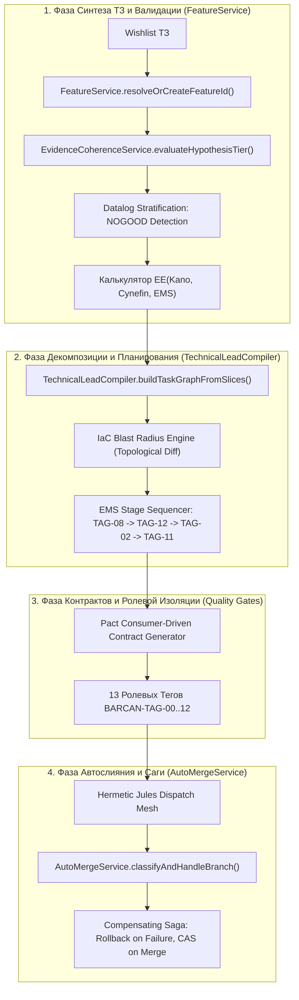

# 🏛️ E³: Eneik Epistemic Engine (Эпистемический Движок Фабрики Eneik)
## Монолитный Математический План Интеграции Паутины Куайна, AGM, ATMS и EMS в Ядро Конвейера

**Версия документа:** 1.0.0-PROD  
**Статус:** Утверждён к поэтапной реализации  
**Цель:** Математическая ликвидация хаоса на этапе определения фич, графовой декомпозиции и автослияния через синтез эпистемической укоренённости Куайна–Гэрденфорса, моделей Кано/Кеневин, сетей когерентности ECHO и компенсирующих саг.

---

### 1. Архитектурный базис и математический формализм

Проект формализуется как динамическая эпистемическая система:
$$\mathcal{W} = \langle \mathcal{K}, \le_{EE}, \vdash, \mathcal{J}, \mathcal{E} \rangle$$

где:
* $\mathcal{K}$ — множество активных убеждений (аксиомы домена, контракты API, инварианты схемы БД, критерии приемки).
* $\le_{EE}$ — предпорядок эпистемической укоренённости (*Epistemic Entrenchment*), монолитно вычисляемый из синтеза Кеневин, Кано и EMS:
  $$\text{EE}(\phi) = \mathbf{W}_{\text{Cynefin}} \cdot \mathcal{C}(\phi) + \mathbf{W}_{\text{Kano}} \cdot \mathcal{K}(\phi) + \mathbf{W}_{\text{EMS}} \cdot \mathcal{E}(\phi)$$
  * $\mathbf{W}_{\text{Cynefin}} = 0.40$ (Simple=100, Complicated=70, Complex=30, Chaotic=0)
  * $\mathbf{W}_{\text{Kano}} = 0.35$ (Must-Be=100, One-Dimensional=60, Attractive=20, Indifferent=0)
  * $\mathbf{W}_{\text{EMS}} = 0.25$ (Stage 1 Schema=100, Stage 2 Contract=70, Stage 3 Code=40, Stage 4 UI=20)
* $\vdash$ — система типов и исчисление предикатов стратифицированного Datalog.
* $\mathcal{J}$ — граф обоснований (*Justifications*), связывающий требования с исходным кодом.
* $\mathcal{E}$ — сеть гармонической релаксации ECHO Пола Тагарда.

```
       [ УРОВЕНЬ 1: ЯДРО ПАУТИНЫ (EE >= 80) — Неизменяемо ]
       * Доменные инварианты (Postgres Schema, Invariant Rules, SecurityConfig)
       * Cynefin: Simple | Kano: Must-Be | EMS: Stage 1 Schema
                      ▲
                      │  Высокая укоренённость (EE)
                      │
       [ УРОВЕНЬ 2: КОНТРАКТЫ (40 <= EE < 80) — Строгие DTO ]
       * API Specifications (OpenAPI, Pact-контракты, DTOs, Endpoints)
       * Cynefin: Complicated | Kano: One-Dimensional | EMS: Stage 2 Contract
                      ▲
                      │  Средняя укоренённость (EE)
                      │
       [ УРОВЕНЬ 3: ПЕРИФЕРИЯ (EE < 40) — Эмпирические гипотезы ]
       * UI-компоненты, визуальные фильтры, стили, экспериментальные фичи
       * Cynefin: Complex | Kano: Attractive | EMS: Stage 3..4 Implementation & UI
```

---

### 2. Принцип минимального ущерба AGM (Levi / Harper Identity)

При поступлении нового требования $\phi$ (вишлист клиента, аудит, Kaizen) фабрика применяет оператор ревизии:
$$\mathcal{K} * \phi = (\mathcal{K} \div \neg \phi) + \phi$$

1. **Expansion ($\mathcal{K} + \phi$):** Если $\phi$ непротиворечиво с $\mathcal{K}$, требование тривиально инкорпорируется в граф.
2. **Contraction ($\mathcal{K} \div \neg \phi$):** Если $\phi$ противоречит ядру $\mathcal{K}_{core}$, система сохраняет утверждения с наибольшей укоренённостью:
   $$\mathcal{K} \div \neg \phi = \{ \psi \in \mathcal{K} \mid \forall \gamma \subseteq \mathcal{K} \ (\gamma \vdash \neg \phi \implies \exists \delta \in \gamma \setminus (\mathcal{K} \div \neg \phi) \text{ s.t. } \delta \le_{EE} \psi) \}$$
   *Периферийные задачи отсекаются, ядро остается математически защищенным.*

---

### 3. Архитектурная карта компонентов и точек интеграции



---

### 4. Поэтапный план реализации (4 фазы до 100% готовности)

#### Фаза 1: Слой гипотез в ECHO и расчет Epistemic Entrenchment (EE)
* **Цель:** Замкнуть разрыв в `EvidenceCoherenceService` и внедрить калькулятор EE на входе в `FeatureService`.
* **Файлы:**
  * `src/main/java/com/eneik/production/services/coherence/EvidenceCoherenceService.java`
  * `src/main/java/com/eneik/production/services/FeatureService.java`
  * `src/main/java/com/eneik/production/models/persistence/HypothesisNodeEntity.java`
* **Критерии приемки:**
  1. `EvidenceCoherenceService` поддерживает двухуровневую структуру (Hypothesis Layer + Evidence Layer).
  2. Вызов `resolveOrCreateFeatureId` в `FeatureService` валидирует гипотезу фичи через сеть когерентности до сохранения.

#### Фаза 2: Blast Radius планировщик в TechnicalLeadCompiler
* **Цель:** Исключить избыточную переработку стабильных задач при обновлении ТЗ.
* **Файлы:**
  * `src/main/java/com/eneik/production/services/compiler/TechnicalLeadCompiler.java`
  * `src/main/java/com/eneik/production/dto/compiler/BlastRadiusReportDto.java`
* **Критерии приемки:**
  1. Компилятор вычисляет топологический diff относительно `docs/plan.json`.
  2. Задачи, находящиеся вне радиуса поражения мутации, сохраняют статус `done` и не генерируют дубликатов.

#### Фаза 3: Consumer-Driven Contracts (Pact DTOs) между Бэкендом и UI
* **Цель:** Аппаратно исключить рассинхрон между бэкенд-эндпоинтами (`TAG-02`) и интерфейсом (`TAG-11`).
* **Файлы:**
  * `src/main/java/com/eneik/production/services/contract/ConsumerContractService.java`
  * `src/main/java/com/eneik/production/services/QualityGateService.java`
* **Критерии приемки:**
  1. Агент контракта (`TAG-12`) генерирует контрактную спецификацию JSON/DTO.
  2. Гейт качества проверяет PR бэкенда и UI на взаимную совместимость по контракту до слияния.

#### Фаза 4: Компенсирующие Саги в AutoMergeService
* **Цель:** Детерминированный откат сбойных веток без оставления фантомных записей в БД.
* **Файлы:**
  * `src/main/java/com/eneik/production/services/AutoMergeService.java`
  * `src/main/java/com/eneik/production/services/orchestration/BranchGarbageCollectorService.java`
* **Критерии приемки:**
  1. При отклонении PR автоматически запускается сага: удаление ветки на GitHub + атомарная пометка `feature_threads.abandoned_at = now()`.
  2. Полное исключение ошибок `HTTP 400 Precondition failed` при последующих запусках задач.

---

### 5. Инварианты надежности и математической строгости

1. **Zero Data Loss:** Журнал фактов и история проекта строго Append-Only (CRDT Lattices).
2. **Deterministic Convergence:** Ревизия убеждений сходится к единственной минимальной модели за конечное время.
3. **Hermetic Branch Isolation:** Ни одна задача не стартует от несуществующей или невалидированной ветки.
