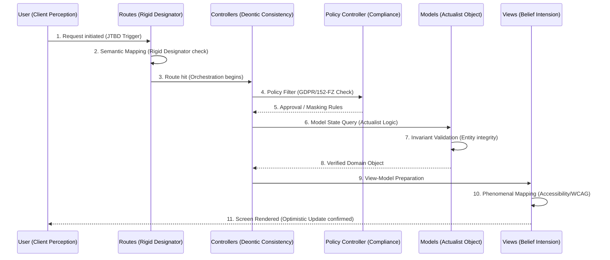

# DATA INTERACTION & SEQUENCE FLOW: THE BARCAN PIPELINE

## 1. HIGH-LEVEL REQUEST TRAVERSAL

In this multi-agent environment, a request isn't just data; it's a series of **Semantic Validations**.

---

## 2. STEP-BY-STEP LOGIC

### Step 1-3: Routing & Semantic Fixation (TAG-02)
- **Role**: `ACC-02 (Rigid Designator)`
- **Logic**: The request is matched against a **Fixed Designator** (OpenAPI Contract). If the input structure deviates from the contract, the request is rejected *before* it hits business logic (Lean Principle: Early Defect Detection).

### Step 4-5: Deontic Filtering (TAG-10)
- **Role**: `ACC-07 (Compliance)`
- **Logic**: The **Policy Controller** injects "Secondary Rules" (Hart's Principle). It checks if the user's "Modal Context" (Location, Role) permits access to specific Model properties.

### Step 6-8: Model Interaction (TAG-01 / TAG-08)
- **Role**: `ACC-02 / ACC-03`
- **Logic**: The Model is queried. The **Actualist Object** ensures only "existing objects" are handled. If the Model belongs to the "ML Layer" (TAG-04), it calculates the predictive state (e.g., "Likelihood of churn") during the fetch.

### Step 9-11: View Perception (TAG-03 / TAG-11)
- **Role**: `ACC-04`
- **Logic**: The **Belief Intension** layer maps the raw Model data into a "Phenomenal Experience." This includes formatting according to the **Atomic Design System** and ensuring **Web Vitals** aren't compromised during hydration.

---

## 3. CONCURRENCY & PROTECTING THE CONSTRAINT

- **The Constraint**: The write-heavy DB Model (TAG-08).
- **Sequence Protection**:
  1. Requests that modify state (POST/PUT) are queued in the **Controller Layer**.
  2. The Controller returns an "Optimistic View" to the User immediately (TAG-11).
  3. The Model update happens asynchronously, protecting the user from system lag (TOC: Buffer Management).
